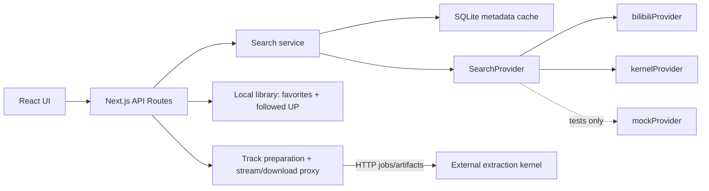

# Architecture

`bili-music-app` is a Next.js App layer for Bilibili music discovery.

The app stores only metadata. It does not persist media in App storage, store cookies, run browser automation, or extract audio. A browser/mobile download is streamed from the kernel through the App and saved only by the client device.

## Layers

- `src/app`: pages and API routes.
- `src/components`: React UI components.
- `src/lib/db.ts`: SQLite metadata persistence.
- `src/lib/search`: provider interface, Bilibili/kernel providers, test-only mock provider, ordered metadata results and cache.
- `src/lib/tracks.ts`: Track lifecycle, kernel job polling, artifact metadata sync.
- `src/lib/kernelClient.ts`: HTTP-only kernel integration.

## Local Library

The App has a metadata-only library, partitioned by the Bilibili identity verified by the kernel. It never trusts a client-supplied owner cookie. `favorite_videos` stores candidate ids and lightweight notes; `preferred_creators` stores bookmarked UP creators; `playback_ranges` stores account/BV start/end metadata and optimistic revisions. The first verified account adopts the legacy library once; later account switches never reassign it. Online results prioritize followed creators within the returned page, preserving source order within each group; local search applies the same priority before pagination. There are no numeric preference weights or background creator search expansions.

This local library never writes to Bilibili. It also never stores cookies, media files, or browser state.

## Track Playback And Client Download

`CandidateVideo` records can be promoted into playable `Track` metadata after a successful external kernel extraction job.

Playback flow:

1. User clicks `播放` or `下载` on a candidate.
2. App creates or reuses a `Track`.
3. App submits a kernel job with `outputs: ["m4a"]`.
4. App polls job status and stores only artifact metadata.
5. Browser plays `/api/tracks/[id]/stream`, or browser/mobile downloads `/api/tracks/[id]/download`.
6. Both routes stream the kernel artifact without buffering; they support `HEAD`, Range resume, size, and SHA-256 metadata.

App ownership and kernel artifact ownership are stored separately. The App owner scopes local Track access; the immutable kernel owner is used only for internal job/artifact requests and is never returned to clients.

First-click playback uses automatic api_dash → browser_network processing. This explicit strategy list excludes experimental MSE unless chosen by the operator. Client preparation uses cancellable, sequential polling with a five-minute ceiling, and saved player state is validated before it can be written back.
