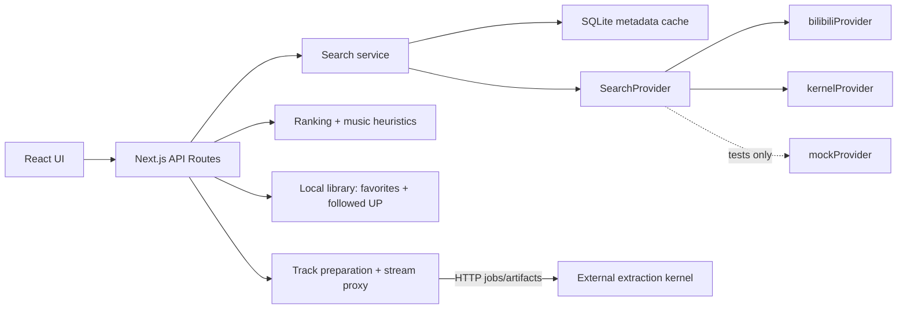

# Architecture

`bili-music-app` is a Next.js App layer for Bilibili music discovery.

The app stores only metadata. It does not download media into App storage, store cookies, run browser automation, or extract audio.

## Layers

- `src/app`: pages and API routes.
- `src/components`: React UI components.
- `src/lib/db.ts`: SQLite metadata persistence.
- `src/lib/search`: provider interface, Bilibili/kernel providers, test-only mock provider, ranking, heuristics, cache.
- `src/lib/tracks.ts`: Track lifecycle, kernel job polling, artifact metadata sync.
- `src/lib/kernelClient.ts`: HTTP-only kernel integration.

## Local Library

The App has a metadata-only local library. `favorite_videos` stores candidate ids and lightweight notes; `preferred_creators` stores followed UP creators and ranking weights. Search merges normal local matches, followed-UP local matches, favorites, and a small remote followed-UP expansion before ranking.

This local library never writes to Bilibili. It also never stores cookies, media files, or browser state.

## Track Playback

`CandidateVideo` records can be promoted into playable `Track` metadata after a successful external kernel extraction job.

Playback flow:

1. User clicks `播放` on a candidate.
2. App creates or reuses a `Track`.
3. App submits a kernel job with `outputs: ["m4a"]`.
4. App polls job status and stores only artifact metadata.
5. Browser plays `/api/tracks/[id]/stream`.
6. The stream route proxies the kernel artifact and forwards `Range` headers.

For small cloud machines, first-click playback defaults to forced `api_dash` instead of full `auto` fallback. This keeps the common path lightweight; browser-based fallback remains available from player settings and queued candidates can be explicitly prewarmed one at a time.
