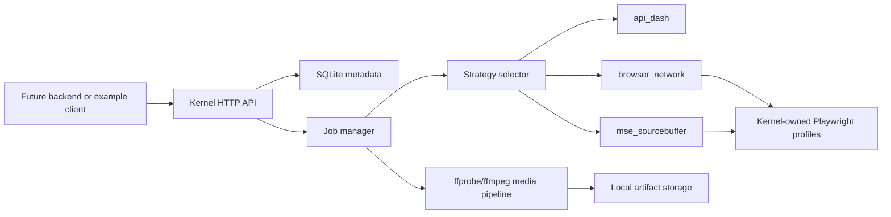

# Architecture

`bili-ctf-audio-kernel` is a single Dockerized FastAPI service.

## Kernel Responsibilities

- Own local profile mapping for `external_owner_id` to `profile_id`.
- Own browser profiles and Bilibili login state.
- Verify profile ownership before every job.
- Lock a profile while a job is running.
- Run extraction strategies sequentially.
- Preserve raw audio artifacts.
- Write artifact metadata and sha256 checksums.

## Non-Responsibilities

- No backend user management.
- No frontend.
- User-provided cookie/storage-state import into kernel profiles is allowed.
- No cookie export or leakage.
- No general-purpose downloader or scraping workflow.
- No CAPTCHA, DRM/EME, region, membership, or anti-bot bypass.

## Storage

The Docker default stores all mutable state under `/data`:

- `/data/kernel.sqlite3`
- `/data/profiles`
- `/data/artifacts`

When running from `kernel/docker-compose.yml`, `/data` is bind-mounted from `kernel/storage`.

These paths can be configured with environment variables.
